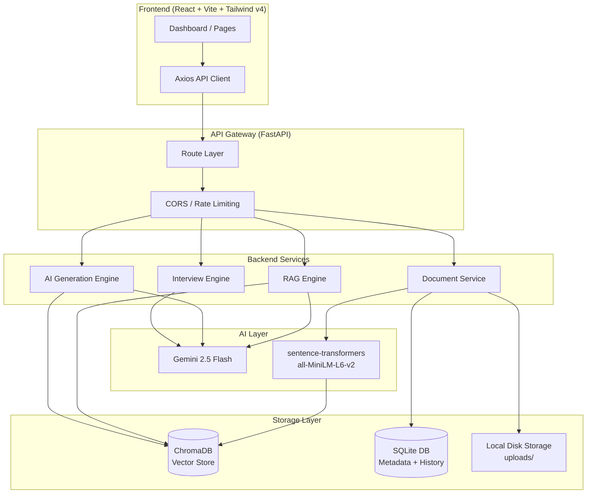

# PrepPilot AI

> **"Your Personal AI-Powered Study, Revision, and Interview Assistant"**
>
> A portfolio-grade, production-ready Full Stack RAG (Retrieval-Augmented Generation) application designed for internships, placements, and technical interview demonstrations.

---

## 🌟 Key Features

*   **📄 Document ingestion Pipeline:** Stream uploads of **PDF**, **DOCX**, and **TXT** files. Text is extracted dynamically, chunked (500 tokens/100 overlap), embedded (via `all-MiniLM-L6-v2`), and indexed inside **ChromaDB**.
*   **💬 Contextual RAG Chat:** Conversational assistant grounded exclusively in uploaded materials. Includes chat session memory (SQLite log history) and dynamic hover citation badges.
*   **📝 Summary Generator:** Generate multiple summaries (Executive briefs, detailed structures, or revision guide formats) instantly, complete with local database caching.
*   **❓ MCQ practice Exams:** Custom test engines creating structured multiple-choice quiz cards (10, 20, or 50 Qs) with immediate checking and explanations.
*   **🃏 3D Flashcards Deck:** Active spaced-repetition card decks featuring responsive Y-axis CSS flipping animations.
*   **🎤 Recruiter Mock Interview:** Match candidate resumes against job descriptions to extract behavioral, technical, and project mock questions with answer talk-points.
*   **📖 Key Points & Revision Sheets:** Rapid exam prep tools compiling bullet cheat sheets and last-minute guides in clean Markdown formats.
*   **🌓 Dark Mode & Glassmorphic UI:** Smooth theme switches, Plus Jakarta Sans typography, and modern responsive panels built with Tailwind CSS v4.

---

## 🏗️ System Architecture



---

## ⚙️ Tech Stack

*   **Frontend:** React.js, Vite, Tailwind CSS v4, Axios, React Router, Lucide Icons.
*   **Backend:** FastAPI, Python 3.11, Pydantic, SQLAlchemy.
*   **Vector DB & ML:** ChromaDB, `sentence-transformers` (`all-MiniLM-L6-v2`).
*   **LLM integration:** Google Gemini 2.5 Flash (via `google-generativeai` with structured JSON output schemas).
*   **Parsers:** `pypdf`, `python-docx`.

---

## 🚀 Installation & Local Launch

### Option 1: Quick Start via Docker Compose (Recommended)

Make sure you have Docker and Docker Compose installed.

1.  **Clone this repository** to your workspace.
2.  **Create `.env` file** at the root of the project:
    ```bash
    cp .env.example .env
    ```
3.  **Insert your Gemini API Key** in the `.env` file:
    ```env
    GEMINI_API_KEY=AIzaSy... # Your Google Gemini API Key
    ```
4.  **Spin up containers:**
    ```bash
    docker compose up --build
    ```
5.  Access the web interface at **`http://localhost:3000`** (FastAPI backend is exposed at `http://localhost:8000`).

---

### Option 2: Local Manual Setup (Development Mode)

#### 1. Backend Inception
1.  Navigate to `backend` directory:
    ```bash
    cd backend
    ```
2.  Create virtual environment and install packages:
    ```bash
    python -m venv venv
    source venv/bin/activate  # On Windows: venv\Scripts\activate
    pip install -r requirements.txt
    ```
3.  Configure environment variables:
    ```bash
    cp .env.example .env
    # Add your GEMINI_API_KEY to the newly created .env file
    ```
4.  Run FastAPI dev server:
    ```bash
    python main.py
    ```
    The Swagger interactive documentation is visible at `http://localhost:8000/docs`.

#### 2. Frontend Launch
1.  Navigate to `frontend` directory:
    ```bash
    cd ../frontend
    ```
2.  Install npm packages:
    ```bash
    npm install
    ```
3.  Boot Vite server:
    ```bash
    npm run dev
    ```
    Open your browser to **`http://localhost:5173`** to access the dashboard.

---

## 🔌 API Documentation Summary

| Method | Endpoint | Description |
| :--- | :--- | :--- |
| **POST** | `/api/v1/upload/` | Upload PDF/DOCX/TXT file and ingest into vector store. |
| **GET** | `/api/v1/documents/` | Get list of all uploaded documents. |
| **DELETE**| `/api/v1/documents/{id}`| Remove document record, delete disk files, drop vector collections. |
| **POST** | `/api/v1/chat/` | Query active document context using semantic RAG. |
| **GET** | `/api/v1/history/{session_id}` | Retrieve chat session history logs. |
| **POST** | `/api/v1/summary/` | Generate tabbed summaries (executive, detailed, revision). |
| **POST** | `/api/v1/mcqs/` | Generate multiple choice practice quizzes. |
| **POST** | `/api/v1/flashcards/` | Generate active memory deck flashcards. |
| **POST** | `/api/v1/interview/` | Compare candidate resume against JDs for mock questioning. |
| **POST** | `/api/v1/keypoints/` | Extract key formulas, definitions, and facts. |
| **POST** | `/api/v1/revision/` | Compile cheat sheets or exam questions. |

---

## 🔮 Future Roadmaps

1.  **React Flow Knowledge Maps:** Integrate mind-mapping visualizations linking extracted concepts.
2.  **AWS S3 File Storage:** Replace local disk directory structures with cloud storage vaults.
3.  **Spaced Repetition SM-2 Scheduler:** Calculate card revisions using SuperMemo scheduler intervals.
4.  **JWT User Authentication:** Add multi-tenant private dashboard boundaries.
