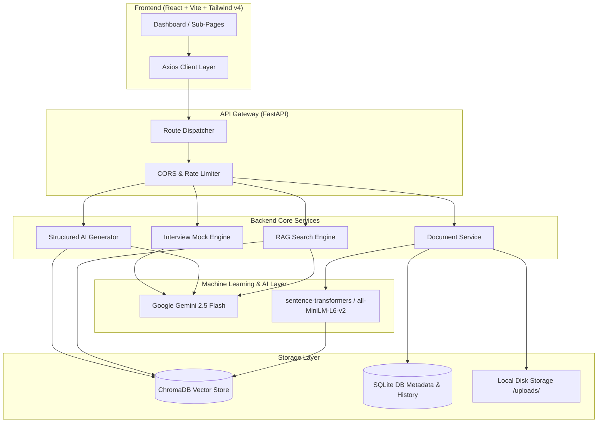

# 🧭 PrepPilot AI

> **Your Personal AI-Powered Study, Revision, and Interview Assistant.**
>
> PrepPilot AI is a portfolio-grade, production-ready Full Stack RAG (Retrieval-Augmented Generation) application. It is engineered to transform raw educational resources (PDFs, Word documents, text files) into structured learning materials, interactive spaced-repetition flashcards, adaptive practice exams, and recruiter-simulated mock interviews.

---

<div align="center">

[](https://fastapi.tiangolo.com)
[](https://react.dev)
[](https://vite.dev)
[](https://ai.google.dev/)
[](https://www.trychroma.com/)
[](https://www.sqlite.org/)
[](https://www.docker.com/)

</div>

---

## 🌟 Key Features

*   **📄 Intelligent Ingestion Pipeline:** Dynamic parsing of **PDF**, **DOCX**, and **TXT** formats. Documents are automatically parsed, chunked via semantic overlap boundaries, mapped into dense vector spaces using `all-MiniLM-L6-v2`, and cataloged in a local vector database.
*   **💬 Context-Aware Document RAG Chat:** Engage in conversational threads grounded exclusively inside your uploaded corpus. Utilizes persistent SQLite session tracking and dynamic citation attribution.
*   **📝 Automated Summarization:** Instantly generate executive summaries, key-topic checklists, or structured revision outlines from long-form documents.
*   **❓ Structured MCQ Exam Engine:** Generate customized multiple-choice practice exams with immediate evaluation and granular answer explanations.
*   **🃏 3D Animated Flashcards:** Spaced-repetition card decks featuring fluid CSS 3D Y-axis flipping animations.
*   **🎤 Recruiter Mock Interviews:** Paste a target job description and compare it against your resume to generate customized behavioral, situational, and technical mock interviews.
*   **📖 Key Points & Revision Sheets:** Rapid exam prep tools compiling bullet cheat sheets, formulas, and last-minute guides in markdown.
*   **🌓 Dark Mode & Glassmorphic UI:** Smooth theme switcher, modern typography (`Plus Jakarta Sans`), and clean layouts built with Vite, Tailwind CSS v4, and React.

---

## 🏗️ System Architecture

PrepPilot AI utilizes a robust, decoupled architecture separating file ingestion, metadata indexing, vector persistence, and large language model coordination.



---

## 📂 Project Folder Structure

```text
PrepPilot/
├── backend/
│   ├── app/
│   │   ├── api/
│   │   │   ├── routes/              # FastAPI Router Controllers
│   │   │   │   ├── chat.py          # RAG Chat logic
│   │   │   │   ├── documents.py     # Metadata retrieval
│   │   │   │   ├── flashcards.py    # Flashcard requests
│   │   │   │   ├── history.py       # Session history logger
│   │   │   │   ├── interview.py     # Resume parser & interview mock
│   │   │   │   ├── keypoints.py     # Summary & Key points extraction
│   │   │   │   ├── mcq.py           # Practice exam builder
│   │   │   │   ├── revision.py      # Quick-revision outlines
│   │   │   │   ├── summary.py       # Comprehensive summaries
│   │   │   │   └── upload.py        # Ingestion & PDF/DOCX parsing
│   │   │   └── deps.py              # DI Container & SQLite connections
│   │   ├── database/                # SQLite setup & schema migrations
│   │   ├── models/                  # SQLAlchemy ORM models
│   │   ├── schemas/                 # Pydantic Request/Response validation schemas
│   │   ├── services/
│   │   │   ├── generators/          # LLM Prompt builders & parsers
│   │   │   ├── llm/                 # Gemini API interaction layer
│   │   │   └── rag/                 # ChromaDB querying & context formulation
│   │   ├── config.py                # Environment configuration loader
│   │   └── main.py                  # API initialization & CORS configuration
│   ├── requirements.txt             # Python backend dependencies
│   └── main.py                      # Main entrypoint runner script
├── frontend/
│   ├── public/                      # Static assets & public resources
│   ├── src/
│   │   ├── assets/                  # CSS files and global visuals
│   │   ├── components/
│   │   │   └── layout/              # Sidebar, Navbar, and Shell layout wrappers
│   │   ├── contexts/                # React Global State providers
│   │   ├── pages/                   # Feature-based Page views (Chat, Flashcards, etc.)
│   │   ├── services/                # Axios integration with Backend API Endpoints
│   │   ├── App.jsx                  # Main router config and route mapping
│   │   └── main.jsx                 # Frontend bootstrapping index entrypoint
│   ├── package.json                 # Node JS frontend dependencies
│   └── vite.config.js               # Vite project configuration
├── docker/                          # Docker config & setup instructions
└── docker-compose.yml               # Complete orchestrator configuration
```

---

## ⚙️ Environment Variables Config

PrepPilot AI separates settings into a unified global structure. Copy the environment template to instantiate local configurations:

### Global Template Configuration (`.env`)
Create a `.env` in the root project folder:

```env
# Backend API Configuration
APP_ENV=development
APP_NAME="PrepPilot AI"
SECRET_KEY=your-secure-secret-key-for-production-runs
ALLOWED_ORIGINS=http://localhost:5173,http://localhost:3000

# Gemini Large Language Model
# Get your API key from Google AI Studio: https://aistudio.google.com/
GEMINI_API_KEY=your_gemini_api_key_here

# Local Data Storage Directories
UPLOAD_DIR=./uploads
CHROMA_PERSIST_DIR=./chroma_db
DATABASE_URL=sqlite+aiosqlite:///./preppilot.db

# RAG Hyperparameters
EMBEDDING_MODEL=all-MiniLM-L6-v2
CHUNK_SIZE=500
CHUNK_OVERLAP=100
TOP_K=5
```

---

## 🚀 Installation & Local Launch

### Option 1: 1-Click Containerized Build (Recommended)
Launch the complete application environment (Frontend, Backend, Database) seamlessly via Docker Compose:

1. Clone this repository to your machine.
2. Create `.env` file at the root of the project:
   ```bash
   cp .env.example .env
   ```
3. Populate your `GEMINI_API_KEY` in the newly created `.env` file.
4. Run the Orchestrator:
   ```bash
   docker compose up --build
   ```
5. Navigate to:
   *   **Frontend Dashboard:** `http://localhost:3000`
   *   **Backend FastAPI Server:** `http://localhost:8000`
   *   **Swagger API Docs:** `http://localhost:8000/docs`

---

### Option 2: Local Manual Setup (Development Mode)

#### 1. Backend Service Launch
Ensure you have **Python 3.11+** installed locally.

1. Navigate to the `backend` directory:
   ```bash
   cd backend
   ```
2. Set up a virtual environment and load dependencies:
   ```bash
   python -m venv venv
   # On Windows (PowerShell):
   .\venv\Scripts\Activate.ps1
   # On macOS/Linux:
   source venv/bin/activate

   pip install -r requirements.txt
   ```
3. Copy the backend local environment configurations:
   ```bash
   cp .env.example .env
   ```
4. Insert your `GEMINI_API_KEY` inside `backend/.env`.
5. Run the FastAPI development server:
   ```bash
   python main.py
   ```
   The backend API will fire up at `http://localhost:8000`.

#### 2. Frontend Launch
Ensure you have **Node.js 18+** installed locally.

1. Navigate to the `frontend` directory:
   ```bash
   cd ../frontend
   ```
2. Install npm packages:
   ```bash
   npm install
   ```
3. Boot up the Vite developer environment:
   ```bash
   npm run dev
   ```
4. Open your web browser and navigate to `http://localhost:5173`.

---

## 🔌 Core API Endpoints

| Method | Endpoint | Description | Request Body / Query Params |
| :--- | :--- | :--- | :--- |
| **POST** | `/api/v1/upload/` | Extract file, create embeddings, ingest into ChromaDB. | Multipart Form-Data (file) |
| **GET** | `/api/v1/documents/` | Fetch a list of metadata for all ingested files. | None |
| **DELETE** | `/api/v1/documents/{id}` | Clear embeddings, SQLite logs, and delete disk file. | File ID path parameter |
| **POST** | `/api/v1/chat/` | Query grounded document context with LLM synthesis. | `{ session_id, message, doc_id }` |
| **GET** | `/api/v1/history/{session_id}` | Retrieve persistent chat conversation logs. | Session ID path parameter |
| **POST** | `/api/v1/summary/` | Request summary of document in varying levels of depth. | `{ doc_id, summary_type }` |
| **POST** | `/api/v1/mcqs/` | Generate multiple-choice exam structures. | `{ doc_id, num_questions }` |
| **POST** | `/api/v1/flashcards/` | Generate active memory flashcards. | `{ doc_id }` |
| **POST** | `/api/v1/interview/` | Generate mock questions based on resume & JD. | `{ resume_text, jd_text }` |
| **POST** | `/api/v1/keypoints/` | Extract key facts, definitions, and equations. | `{ doc_id }` |
| **POST** | `/api/v1/revision/` | Compile custom study revision sheets. | `{ doc_id }` |

---

## 🔮 Future Roadmap

1. **interactive Mind Maps (React Flow):** Auto-generate structured, interactive visual maps connecting critical conceptual nodes found within documents.
2. **Cloud Vector Database (Pinecone/Milvus):** Migrate from local directory-based storage to hosted indexes for large-scale operations.
3. **SuperMemo SM-2 Card Scheduling:** Keep track of users' correctness profiles to implement predictive spacing recommendations.
4. **JWT-Based Multi-Tenancy Authentication:** Implement secure user registration, token validation, and multi-tenant isolated workspaces.
5. **Real-time Voice Mock Interviews:** Use WebRTC & audio pipelines to simulate oral mock recruiter interviews with real-time feedback.
