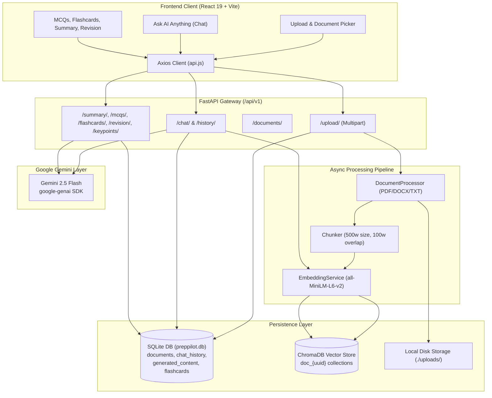

# 🧭 PrepPilot AI — Comprehensive Repository Context & Architectural Analysis

> **Document Type:** Full Repository Context, Architectural Audit, Pedagogical Analysis & Strategic Transformation Blueprint  
> **Target Audience:** Engineering Team, EdTech Educators, Product Architects  
> **Repository:** `PrepPilot` (Full Stack AI Academic Study & Exam Preparation Platform)  
> **Analyzed Version:** 1.0 (Post-Ingestion & Companion Service Integration)  
> **Date:** August 2026

---

## 1. Executive Summary & Mission

**PrepPilot AI** is a full-stack Retrieval-Augmented Generation (RAG) platform designed to ingest raw academic documents (PDFs, DOCX files, TXT notes) and transform them into interactive, mastery-driven study materials:
1. **Context-Aware Socratic AI Tutoring** ("Ask AI Anything")
2. **Automated Structured Summarization** (Executive, Detailed, Revision Outlines)
3. **Adaptive Multiple-Choice Exam Generation** (Granular Explanations & Scoring)
4. **3D Spaced-Repetition Flashcards** (Active Recall & Self-Rating)
5. **High-Yield Revision & Last-Minute Cheat Sheets**
6. **Resume vs. Job Description Mock Interview Simulator**
7. **Document Key Points & Definitions Extraction**

### The Core Problem Today
While the foundational backend RAG pipeline and generation engines are well-engineered, the application currently suffers from **two critical disconnects**:
1. **Severe UI/UX Overwhelm & Cognitive Overload:** The "Ask AI Anything" page is congested with a forced 3-pane layout, persistent HUDs, archetype switchers, and multiple overlapping status trackers that overwhelm students rather than helping them focus on learning.
2. **Hardcoded Mock Disconnection:** The frontend chat interface (`ChatPage.jsx`) is wired to a static mock service (`companionService.js`) containing hardcoded Computer Science topics (`binary_search`, `osi_model`, `tcp_handshake`, etc.) that completely ignore the student's uploaded academic PDF. Asking questions about an uploaded biology, history, chemistry, or economics PDF results in hardcoded fallbacks instead of real document-grounded RAG answers with citations.

---

## 2. Technical Stack & Repository Architecture

### 2.1 Technology Matrix

| Layer | Technologies & Libraries | Key Responsibilities |
| :--- | :--- | :--- |
| **Frontend UI** | React 19.2, Vite 8, Tailwind CSS v4, Lucide React | Modern responsive UI, client-side routing, glassmorphic themes, dark mode toggle |
| **Math & Visuals** | KaTeX (`MathRenderer.jsx`), Lucide icons, Canvas visualizers | Mathematical LaTeX parsing ($...$, $$...$$), dynamic visual diagrams |
| **HTTP & State** | Axios 1.17, React Context (`DocumentContext`, `ThemeContext`, `LearnerProfileContext`) | REST communication with backend, document registry, active session persistence |
| **Backend API** | FastAPI 0.115+, Python 3.11+, Uvicorn, SlowAPI | Async REST controllers, background worker tasks, CORS & error handling |
| **Database & ORM**| SQLite, SQLAlchemy 2.0 (Async with `aiosqlite`), Pydantic v2 | Document metadata, chat history, generated study cache, flashcards |
| **Vector DB** | ChromaDB `PersistentClient` (Local `./chroma_db`) | Per-document isolated collections (`doc_{uuid}`), L2 similarity search |
| **Embeddings** | `sentence-transformers/all-MiniLM-L6-v2` (PyTorch) | 384-dimensional dense semantic vectors, batch text encoding |
| **LLM Provider** | Google GenAI SDK (`google-genai`), Gemini 2.5 Flash | Socratic tutoring, structured JSON generation, markdown synthesis |
| **Doc Processors**| `pypdf.PdfReader`, `python-docx`, UTF-8 / Latin-1 file reader | Text and metadata extraction across diverse document formats |

---

### 2.2 System Data Flow Architecture



---

## 3. Database Schema & API Surface

### 3.1 SQLite Relational Models (`preppilot.db`)

| Table Name | Primary Key | Foreign Keys | Columns | Description |
| :--- | :--- | :--- | :--- | :--- |
| `documents` | `id` (UUIDv4) | — | `filename`, `file_type`, `upload_date`, `chunk_count`, `file_size`, `status`, `metadata_json` | Document registry and ingestion status (`processing`, `ready`, `error`). |
| `chat_history` | `id` (UUIDv4) | `document_id` -> `documents.id` | `session_id`, `question`, `answer`, `sources` (JSON), `timestamp` | Persistent conversational history with source citations. |
| `generated_content` | `id` (UUIDv4) | `document_id` -> `documents.id` | `content_type`, `subtype`, `generated_text`, `model_used`, `created_at` | Polymorphic cache for summaries, MCQs, revision notes, keypoints. |
| `flashcards` | `id` (UUIDv4) | `document_id` -> `documents.id` | `deck_name`, `front`, `back`, `difficulty`, `created_at` | Individual flashcard cards generated per document. |

---

### 3.2 REST API Endpoint Inventory

| HTTP Method | Route Endpoint | Controller Module | Purpose | Status |
| :--- | :--- | :--- | :--- | :--- |
| `POST` | `/api/v1/upload/` | `upload.py` | Upload PDF/DOCX/TXT & trigger background RAG indexing | ✅ Operational |
| `GET` | `/api/v1/documents/` | `documents.py` | List all documents with chunk counts & status | ✅ Operational |
| `GET` | `/api/v1/documents/{id}` | `documents.py` | Retrieve single document metadata | ✅ Operational |
| `DELETE`| `/api/v1/documents/{id}` | `documents.py` | Delete file from disk, drop Chroma collection, cascade delete DB | ✅ Operational |
| `POST` | `/api/v1/chat/` | `chat.py` | Retrieve vector context + query Gemini + log history | ✅ Operational (Backend) |
| `GET` | `/api/v1/history/{session_id}` | `history.py` | Fetch all historical Q&As for session | ✅ Operational |
| `DELETE`| `/api/v1/history/{session_id}` | `history.py` | Clear session chat history | ✅ Operational |
| `POST` | `/api/v1/summary/` | `summary.py` | Generate or fetch cached summary (executive/detailed/revision) | ✅ Operational |
| `GET` | `/api/v1/summary/{doc_id}` | `summary.py` | Fetch cached summaries | ✅ Operational |
| `POST` | `/api/v1/mcqs/` | `mcq.py` | Generate structured MCQs with JSON schema & caching | ✅ Operational |
| `GET` | `/api/v1/mcqs/{doc_id}` | `mcq.py` | Fetch cached MCQ sets | ✅ Operational |
| `POST` | `/api/v1/flashcards/` | `flashcards.py` | Generate flashcards and save to DB | ✅ Operational |
| `GET` | `/api/v1/flashcards/{doc_id}` | `flashcards.py` | Fetch generated flashcards | ✅ Operational |
| `POST` | `/api/v1/revision/` | `revision.py` | Generate cheat sheet / last minute revision sheet | ✅ Operational |
| `GET` | `/api/v1/revision/{doc_id}` | `revision.py` | Fetch cached revision sheets | ✅ Operational |
| `POST` | `/api/v1/keypoints/` | `keypoints.py` | Extract categorized key points, concepts & formulas | ⚠️ Backend only |
| `POST` | `/api/v1/interview/` | `interview.py` | Generate recruiter mock questions from Resume + JD | ✅ Operational |

---

## 4. In-Depth Feature Audit & Identified Shortcomings

### 4.1 "Ask AI Anything" Page (`ChatPage.jsx` & Companion System)

#### Current Implementation Analysis
`ChatPage.jsx` was designed as an "AI Learning Companion" containing:
1. A top topic bar with 9 hardcoded buttons: Study Navigator, Knowledge Graph, Binary Search, OSI 7-Layer, TCP Handshake, DBMS Normalization, Newton's Laws, BST Trees, Recursion & DP.
2. A `LearnerProfileHUD` with 4 hardcoded student archetypes (Student A, B, C, D) and mastery percentages.
3. A `LearningLoopTracker` displaying static status banners.
4. A forced 3-column split grid:
   - **Left Pane (~35%):** `AITutorChat.jsx` (Chat feed, decision banners, action chips).
   - **Center Pane (~40%):** `VisualCanvas.jsx` (13 visualizer tabs: code visualizer, math derivation, OSI stack, TCP handshake, normalization, etc.).
   - **Right Pane (~25%):** `CompactInsightsPanel.jsx` (Mastery metrics, prerequisite cards, progress tabs).
5. Data layer: Uses `companionService.js` (a 593-line hardcoded mock dataset) instead of connecting to `chatService.js` and `/api/v1/chat/`.

#### Why This Fails the User & Student:
- **Disconnection from Uploaded Documents:** When a student uploads a PDF on *Organic Chemistry*, *Constitutional Law*, or *Macroeconomics*, the Chat Page does not read their document. It ignores the active document and forces Binary Search or other CS topics.
- **Extreme Visual Clutter:** 3 narrow panes on one screen make the chat bubble width tiny, truncate text, force horizontal scrollbars everywhere, and overwhelm the student with 20+ buttons and badges simultaneously.
- **Loss of True Document Citations:** Students need to see where an answer comes from in their specific uploaded document (e.g. *Page 7, Paragraph 3*), but the mock service returns static text.

---

### 4.2 Document Ingestion & Upload (`UploadPage.jsx`)
- **Working:** Drag-and-drop file upload, file type checking (`.pdf`, `.docx`, `.txt`), file size limit (50MB), background processing task, document list with deletion.
- **Shortcoming:** After uploading, the frontend only triggers `fetchDocuments()` once immediately. Since text extraction, chunking, and embedding occur in a background task, the document appears in `processing` status and never auto-updates to `ready` unless the user manually refreshes the page.

---

### 4.3 Summary, MCQs, Flashcards, and Revision Notes
- **Working:** Full integration with backend generation endpoints, structured JSON parsing, Markdown output, caching in `generated_content` table.
- **Shortcoming 1 (No Regeneration):** Caching is rigid. If a student wants to generate a *new* set of MCQs or an updated revision sheet, there is no "Regenerate" / force-refresh option in the UI or API.
- **Shortcoming 2 (Flashcard Persistence):** Flashcard self-ratings (Easy/Medium/Hard) are stored only in React state and lost on page refresh.
- **Shortcoming 3 (Markdown Parsing):** `SummaryPage.jsx` and `RevisionPage.jsx` use a custom manual string splitting parser with regular expression flaws rather than a unified, robust Markdown + Math component.

---

### 4.4 Key Points Extraction (`keypoints.py`)
- **Working:** Backend route `/api/v1/keypoints/` generates categorized concepts, definitions, formulas, facts, and tips using Gemini structured output. `studyService.js` has `generateKeyPoints()`.
- **Shortcoming:** **No frontend page or navigation item exists.** The feature is completely hidden from the user.

---

### 4.5 Settings Page (`SettingsPage.jsx`)
- **Shortcoming:** The page allows users to save a custom Backend API URL to `localStorage`, but `api.js` loads `VITE_API_URL` statically at module import time and never checks `localStorage`. The setting does nothing.

---

## 5. Pedagogical Analysis: Thinking Like an Expert EdTech Educator

To transform PrepPilot into a world-class academic learning tool for students studying any PDF, we must ground our redesign in established learning sciences:

### 5.1 Cognitive Load Theory (John Sweller)
- **Extraneous Cognitive Load (The Interface):** Must be minimized to near zero. A student should never wonder *"Where do I look?"* or *"What do all these 30 buttons mean?"*. A clean, spacious, distraction-free reading and chatting canvas is essential.
- **Intrinsic Cognitive Load (The Content):** Academic PDFs are inherently dense. The AI Tutor should break complex topics down progressively rather than dumping a wall of text.
- **Germane Cognitive Load (Schema Building):** Facilitated by clear mental models, visual analogies, structured key takeaways, and immediate 1-question micro-checks.

### 5.2 Socratic Scaffolding & Bloom's Taxonomy
When a student asks a question about their PDF, a great tutor does not just paste Wikipedia paragraphs. A great tutor adapts based on the student's selected learning mode:

```text
Bloom's Cognitive Progression:
[1. Remember]   ──> High-Yield Cheat Sheets & Flashcards
[2. Understand] ──> Socratic Dialogue & "Explain Like I'm 5" Analogies
[3. Apply]      ──> Step-by-Step Worked Problem Examples
[4. Analyze]    ──> Comparison Matrices & Prerequisite Trade-offs
[5. Evaluate]   ──> Instant Micro-Quizzes & MCQ Practice Exams
```

### 5.3 Five Essential Pedagogical Tutor Modes
Students have different study needs depending on where they are in their preparation:
1. 🎓 **Socratic Guide:** Doesn't just give the answer; guides the student with thoughtful questions to help them derive the insight themselves.
2. 📖 **Direct & Comprehensive:** Clear, textbook-quality breakdown with definitions, governing equations (in LaTeX), and bulleted mechanisms.
3. ⚡ **Exam Cram / High-Yield:** Zero fluff — high-yield formulas, key exam traps, common mistakes, and summary bullet points.
4. 👶 **ELI5 (Explain Like I'm 5):** Uses intuitive real-world metaphors and everyday analogies to demystify intimidating jargon.
5. 📝 **Step-by-Step Worked Example:** Breaks down calculations, proofs, and algorithmic traces one logical step at a time.

---

## 6. Strategic Master Improvement Plan

### Goal 1: Complete UI & Architectural Overhaul of "Ask AI Anything"
- **Primary Single-Focus / Clean Two-Panel Layout:**
  - **Left / Main Stage (Primary Focus):** Full-height, elegant Socratic AI conversation stream.
    - Active Document indicator with page count and status.
    - Pedagogical Tutor Mode switcher (Socratic, Direct, Exam Cram, ELI5, Step-by-Step).
    - True RAG responses grounded in the uploaded document.
    - Collapsible source citations showing the exact page number, text snippet, and match relevance score.
    - Inline dynamic follow-up prompts generated from the document context.
    - Instant "Micro-Quiz / Check Understanding" button.
  - **Right Drawer / Slide-Over Visual & Notes Canvas (On-Demand):**
    - Opened cleanly when the student requests "Show visually" or when a visual payload/derivation/diagram is generated.
    - Can be toggled, expanded to full screen, or collapsed with a single click so it never crowds the chat.
    - Dynamically renders Mermaid flowcharts, LaTeX derivations, comparison tables, or structured notes.

### Goal 2: Remove All Hardcoded Mocks & Connect Real Document RAG
- Deprecate hardcoded CS topics in `ChatPage.jsx`.
- Wire `ChatPage.jsx` directly to `chatService.js` -> `/api/v1/chat/`.
- Ensure that if no document is selected, the tutor can either answer general academic queries or provide a friendly prompt to select/upload a document.
- If a document is selected, pass its `document_id` and top-K parameter to retrieve real vector chunks from ChromaDB and ground the Gemini response.

### Goal 3: Fix All Frontend & Backend Bugs & Gaps
1. **Document Status Polling:** Add automatic interval polling in `UploadPage.jsx` and `DocumentContext.jsx` so documents automatically transition from `processing` to `ready`.
2. **Settings API Base URL:** Update `api.js` to dynamically read from `localStorage.getItem("preppilot_api_url")` with a fallback to `import.meta.env.VITE_API_URL`.
3. **Key Points Page:** Add a dedicated, beautifully formatted `KeyPointsPage.jsx` and add it to the sidebar navigation and dashboard quick actions.
4. **Cache Invalidation & Regeneration:** Add a "Regenerate / New Set" button on Summary, MCQ, Revision, and Key Points pages to force-refresh AI outputs.
5. **Flashcard Persistence & Spaced Repetition:** Store user card ratings in `localStorage` (or backend) and add a "Review Hard Cards" filter.
6. **Unified Markdown & KaTeX Component:** Replace buggy custom regex string-splitters with a polished, robust Markdown + LaTeX renderer across all study pages.

---

## 7. Summary of Files to Modify & Create

| Action | File Path | Scope of Change |
| :--- | :--- | :--- |
| **REFACTOR** | `frontend/src/pages/ChatPage.jsx` | Completely redesign into an uncluttered, document-grounded Socratic AI study companion with pedagogical mode selection and on-demand visual side drawer. |
| **CONNECT** | `frontend/src/services/chatService.js` | Ensure full payload support for tutor modes, document grounding, and history sessions. |
| **CLEANUP** | `frontend/src/services/companionService.js` | Replace static hardcoded mocks with real dynamic fallback handling and API proxying. |
| **FIX** | `frontend/src/services/api.js` | Enable dynamic base URL resolution from `localStorage`. |
| **ENHANCE** | `frontend/src/contexts/DocumentContext.jsx` | Add auto-polling for documents with `processing` status. |
| **NEW** | `frontend/src/pages/KeyPointsPage.jsx` | Create dedicated Key Points extraction & study sheet page. |
| **UPDATE** | `frontend/src/App.jsx` | Add route for `/keypoints`. |
| **UPDATE** | `frontend/src/components/layout/Sidebar.jsx` | Add "Key Points" navigation item and ensure clean active states. |
| **ENHANCE** | `frontend/src/pages/MCQPage.jsx` | Add "Generate New Questions" regeneration capability and topic filter. |
| **ENHANCE** | `frontend/src/pages/SummaryPage.jsx` | Add "Regenerate" button and unified markdown rendering. |
| **ENHANCE** | `frontend/src/pages/RevisionPage.jsx` | Fix markdown regex parsing bug and add regeneration support. |
| **ENHANCE** | `frontend/src/pages/FlashcardsPage.jsx` | Persist ratings in localStorage with review filters. |
| **ENHANCE** | `backend/app/services/llm/gemini_client.py` | Add tutor mode support in system prompts for adaptive Socratic vs Direct explanations. |
| **ENHANCE** | `backend/app/api/routes/chat.py` | Accept optional `tutor_mode` in `ChatRequest` to steer pedagogical style. |

---

*End of Context Document.*
