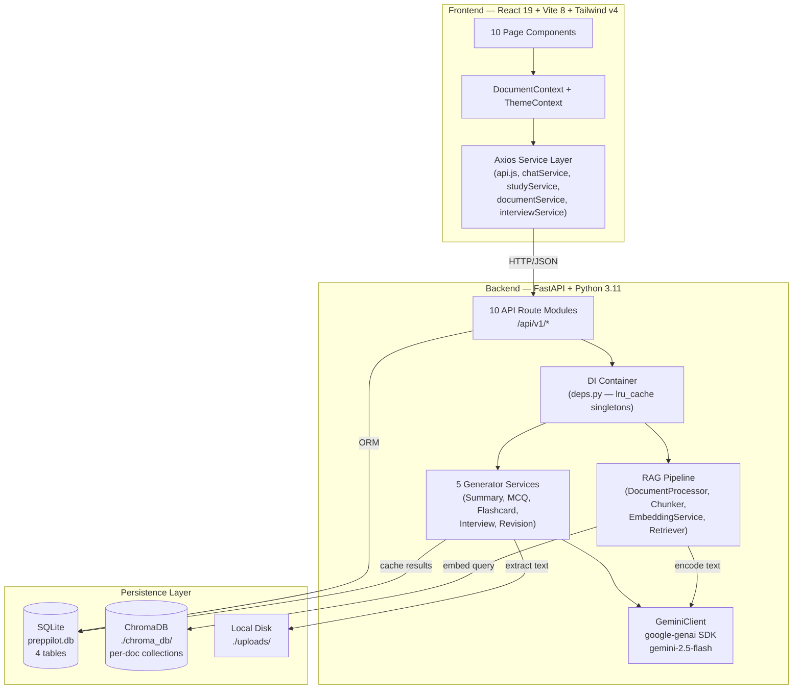

# 🔍 PrepPilot AI — Complete Codebase Audit

> **Audit Date:** 2026-08-18  
> **Scope:** Every source file in `backend/`, `frontend/`, `docker/`, `tests/`, and root config  
> **Method:** Line-by-line source code inspection — no assumptions from README claims

---

## 1. CURRENTLY IMPLEMENTED ✅

Every item below has working backend routes, service logic, and a connected frontend page.

### Document Ingestion Pipeline (Full RAG Pipeline)
| Layer | Evidence |
|---|---|
| **File Upload** | [upload.py](file:///c:/Users/abhis/Desktop/new%20one/backend/app/api/routes/upload.py) — `POST /api/v1/upload/`, multipart form-data, validates `.pdf`/`.docx`/`.txt`, async file write with 50 MB limit, creates SQLite `Document` record with `processing` status |
| **Text Extraction** | [document_processor.py](file:///c:/Users/abhis/Desktop/new%20one/backend/app/services/rag/document_processor.py) — `pypdf.PdfReader` for PDF, `python-docx` for DOCX, raw file read for TXT with UTF-8/Latin-1 fallback |
| **Chunking** | [chunker.py](file:///c:/Users/abhis/Desktop/new%20one/backend/app/services/rag/chunker.py) — word-level sliding window with configurable `chunk_size=500` and `chunk_overlap=100`, paragraph boundary awareness |
| **Embedding** | [embeddings.py](file:///c:/Users/abhis/Desktop/new%20one/backend/app/services/rag/embeddings.py) — `sentence-transformers/all-MiniLM-L6-v2`, lazy-loaded singleton, batch encoding support |
| **Vector Storage** | [vector_store.py](file:///c:/Users/abhis/Desktop/new%20one/backend/app/services/rag/vector_store.py) — ChromaDB `PersistentClient`, per-document collections (`doc_{uuid}`), L2 distance → similarity score conversion |
| **Background Processing** | Upload route schedules `process_document_task` as a FastAPI `BackgroundTask` — status updates to `ready`/`error` in SQLite |
| **Frontend** | [UploadPage.jsx](file:///c:/Users/abhis/Desktop/new%20one/frontend/src/pages/UploadPage.jsx) — drag-and-drop zone, progress bar, file validation, document inventory table with delete |

### RAG Chat (Document-Grounded Q&A)
| Layer | Evidence |
|---|---|
| **Retrieval** | [retriever.py](file:///c:/Users/abhis/Desktop/new%20one/backend/app/services/rag/retriever.py) — embeds user question → ChromaDB `query_similarity` → Top-K chunks with metadata |
| **Generation** | [gemini_client.py](file:///c:/Users/abhis/Desktop/new%20one/backend/app/services/llm/gemini_client.py#L83-L114) `generate_answer()` — system prompt enforces document-only grounding, injects chat history (last 5 turns), cites page numbers |
| **Chat History** | [chat.py](file:///c:/Users/abhis/Desktop/new%20one/backend/app/api/routes/chat.py) persists Q&A + source citations in SQLite `chat_history` table; [history.py](file:///c:/Users/abhis/Desktop/new%20one/backend/app/api/routes/history.py) retrieves/clears by session |
| **Frontend** | [ChatPage.jsx](file:///c:/Users/abhis/Desktop/new%20one/frontend/src/pages/ChatPage.jsx) — real-time chat bubbles, citation tooltips showing chunk snippets + match %, typing indicator, session persistence via `localStorage` |

### Document Summarization (3 Types)
| Layer | Evidence |
|---|---|
| **Backend** | [summary_generator.py](file:///c:/Users/abhis/Desktop/new%20one/backend/app/services/generators/summary_generator.py) — generates `executive`, `detailed`, `revision` summaries via Gemini; caches in `GeneratedContent` table |
| **Frontend** | [SummaryPage.jsx](file:///c:/Users/abhis/Desktop/new%20one/frontend/src/pages/SummaryPage.jsx) — tab switcher, custom Markdown renderer, generate-on-demand with cache loading |

### MCQ Practice Exam Engine
| Layer | Evidence |
|---|---|
| **Backend** | [mcq_generator.py](file:///c:/Users/abhis/Desktop/new%20one/backend/app/services/generators/mcq_generator.py) + [gemini_client.py](file:///c:/Users/abhis/Desktop/new%20one/backend/app/services/llm/gemini_client.py#L144-L212) — Gemini structured JSON output with enforced schema (`question`, `options {A,B,C,D}`, `correct_answer`, `explanation`, `difficulty`); 10/20/50 question counts; easy/medium/hard difficulty; cached per `count_difficulty` key |
| **Frontend** | [MCQPage.jsx](file:///c:/Users/abhis/Desktop/new%20one/frontend/src/pages/MCQPage.jsx) — full quiz flow: configuration screen → sequential question cards → option selection → check answer → show explanation → progress bar → final score ring display with percentage and feedback text |

### Flashcard Study Decks
| Layer | Evidence |
|---|---|
| **Backend** | [flashcard_generator.py](file:///c:/Users/abhis/Desktop/new%20one/backend/app/services/generators/flashcard_generator.py) — Gemini structured JSON (`front`, `back`, `difficulty`), persisted individually in `flashcards` table, cached per deck name |
| **Frontend** | [FlashcardsPage.jsx](file:///c:/Users/abhis/Desktop/new%20one/frontend/src/pages/FlashcardsPage.jsx) — CSS 3D Y-axis flip animation (`perspective: 1000px`, `rotateY(180deg)`, `backfaceVisibility: hidden`), self-rating system (easy/medium/hard), deck naming, prev/next navigation |

### Mock Interview Preparation
| Layer | Evidence |
|---|---|
| **Backend** | [interview_generator.py](file:///c:/Users/abhis/Desktop/new%20one/backend/app/services/generators/interview_generator.py) — takes uploaded resume doc + pasted JD text → Gemini generates categorized questions (HR, Technical, Behavioral, Project, Mock with expected answer hints) |
| **Frontend** | [InterviewPage.jsx](file:///c:/Users/abhis/Desktop/new%20one/frontend/src/pages/InterviewPage.jsx) — resume document selector dropdown, JD textarea, tabbed result display, expandable mock interview guidance panels |

### Revision Sheets (3 Types)
| Layer | Evidence |
|---|---|
| **Backend** | [revision_generator.py](file:///c:/Users/abhis/Desktop/new%20one/backend/app/services/generators/revision_generator.py) — `last_minute`, `cheat_sheet`, `important_questions` types; Markdown output; cached in `GeneratedContent` |
| **Frontend** | [RevisionPage.jsx](file:///c:/Users/abhis/Desktop/new%20one/frontend/src/pages/RevisionPage.jsx) — tab switcher, custom Markdown renderer, generate-on-demand |

### Key Points Extraction
| Layer | Evidence |
|---|---|
| **Backend** | [keypoints.py](file:///c:/Users/abhis/Desktop/new%20one/backend/app/api/routes/keypoints.py) — extracts text from doc → Gemini structured JSON output categorized into Concepts, Definitions, Formulas, Facts, Tips |
| **Frontend** | No dedicated page (accessed via API only or potentially embedded — the Summary page's "High-Yield Sheet" serves a similar purpose visually) |

### Infrastructure & DevOps
| Item | Evidence |
|---|---|
| **SQLite + SQLAlchemy Async** | [base.py](file:///c:/Users/abhis/Desktop/new%20one/backend/app/database/base.py) — `aiosqlite`, `AsyncSession`, auto table creation on startup |
| **4 ORM Models** | `Document`, `ChatHistory`, `GeneratedContent`, `Flashcard` — with proper FK relationships and cascade deletes |
| **Pydantic v2 Schemas** | 6 schema modules: [chat](file:///c:/Users/abhis/Desktop/new%20one/backend/app/schemas/chat.py), [document](file:///c:/Users/abhis/Desktop/new%20one/backend/app/schemas/document.py), [flashcard](file:///c:/Users/abhis/Desktop/new%20one/backend/app/schemas/flashcard.py), [interview](file:///c:/Users/abhis/Desktop/new%20one/backend/app/schemas/interview.py), [mcq](file:///c:/Users/abhis/Desktop/new%20one/backend/app/schemas/mcq.py), [summary](file:///c:/Users/abhis/Desktop/new%20one/backend/app/schemas/summary.py) |
| **CORS Middleware** | Configurable via `ALLOWED_ORIGINS` env var, includes Vercel deployment URL |
| **Rate Limiting** | [rate_limiter.py](file:///c:/Users/abhis/Desktop/new%20one/backend/app/middleware/rate_limiter.py) — `slowapi` with IP-based keying (limiter is registered but no per-route limits are explicitly applied to individual endpoints) |
| **Docker** | [docker-compose.yml](file:///c:/Users/abhis/Desktop/new%20one/docker-compose.yml) — 2-service stack: Python backend + nginx-fronted Vite build; named volumes for uploads/chromadb |
| **API Retry Logic** | [gemini_client.py](file:///c:/Users/abhis/Desktop/new%20one/backend/app/services/llm/gemini_client.py#L41-L46) — `tenacity` with exponential backoff (3 attempts, 2-10s wait) for transient 5xx/429 errors |
| **Dark Mode** | [ThemeContext.jsx](file:///c:/Users/abhis/Desktop/new%20one/frontend/src/contexts/ThemeContext.jsx) — system preference detection, `localStorage` persistence, `html.dark` class toggle |
| **Tests** | [test_rag.py](file:///c:/Users/abhis/Desktop/new%20one/backend/tests/test_rag.py) — 3 unit tests covering chunker word-splitting, TXT text extraction, and vector store add/query/delete cycle |

---

## 2. PARTIALLY IMPLEMENTED ⚠️

### Rate Limiting
- **Registered** but **not enforced per-route**. The `limiter` instance is attached to `app.state` and the `RateLimitExceeded` handler is added, but no route decorator (e.g., `@limiter.limit("5/minute")`) exists on any endpoint. Currently a no-op.

### Key Points — No Dedicated Frontend Page
- The `/api/v1/keypoints/` endpoint is fully functional and generating structured output. However, there is **no dedicated frontend page** for Key Points. The `studyService.js` has the `generateKeyPoints()` function wired up, but no page component renders or calls it. The sidebar navigation does not list "Key Points" as an option.

### Flashcard Self-Rating — No Persistence
- The [FlashcardsPage.jsx](file:///c:/Users/abhis/Desktop/new%20one/frontend/src/pages/FlashcardsPage.jsx#L86-L96) tracks user difficulty ratings in a local `ratings` state object, but **this data is never sent to the backend** and is lost on page refresh. There is no API endpoint to receive or store user rating feedback.

### Document Status Polling
- After upload, the frontend does not poll for document processing completion. The `fetchDocuments()` call occurs once after upload, but if the background task is still running, the user sees `processing` status without automatic refresh.

### Settings Page — API URL Override Not Connected
- [SettingsPage.jsx](file:///c:/Users/abhis/Desktop/new%20one/frontend/src/pages/SettingsPage.jsx) lets users save a custom Backend API URL to `localStorage`, but the Axios client in [api.js](file:///c:/Users/abhis/Desktop/new%20one/frontend/src/services/api.js) reads from `import.meta.env.VITE_API_URL` at module load time, **not from localStorage**. The saved URL has no effect.

### Generation Caching — No Regeneration Option
- MCQs, summaries, and revision notes all check for cached results first. Once generated, there is **no UI or API mechanism to force regeneration** (invalidate cache). Users get the same cached content forever.

---

## 3. NOT IMPLEMENTED / FUTURE 🚫

These are features from the competition vision that have **zero implementation evidence** in the codebase:

| Feature | Status |
|---|---|
| **User Authentication / Multi-Tenancy** | No `User` model, no JWT, no login/register endpoints. `python-jose` and `passlib` are in `requirements.txt` but entirely unused. All data is shared globally. |
| **Exam Intelligence / Topic Analysis** | No topic extraction, no syllabus mapping, no topic-frequency analysis. |
| **Topic Prioritization Engine** | No weighting system for important vs. less-important topics. |
| **Personal Weakness Mapping** | MCQ scores are displayed but **never stored**. No per-topic performance tracking. No weakness identification logic. |
| **Adaptive Practice** | MCQ generation is static — no adaptation based on past performance. Every quiz is generated independently. |
| **Smart Revision / Spaced Repetition (SM-2)** | Flashcard ratings are frontend-only and not persisted. No scheduling algorithm. No review intervals. |
| **Exam Readiness Score** | No composite scoring system. No dashboard aggregating user progress across features. |
| **Mind Maps (React Flow)** | No implementation. Listed in README "Future Roadmap". |
| **Cloud Vector DB (Pinecone/Milvus)** | Using local ChromaDB only. |
| **Real-time Voice Interviews (WebRTC)** | No audio/video processing. |
| **Analytics Dashboard** | The dashboard shows document counts only — no study analytics, no charts, no progress tracking over time. |
| **PDF Export** | No ability to export summaries, revision sheets, or quiz results as downloadable files. |

---

## 4. CURRENT SYSTEM ARCHITECTURE

### High-Level Data Flow

### Database Schema (SQLite — 4 Tables)

| Table | Key Columns | Purpose |
|---|---|---|
| `documents` | `id`, `filename`, `file_type`, `file_size`, `status`, `chunk_count`, `metadata_json`, `upload_date` | Document metadata registry |
| `chat_history` | `id`, `session_id`, `document_id` (FK), `question`, `answer`, `sources` (JSON), `timestamp` | RAG chat conversation log |
| `generated_content` | `id`, `document_id` (FK), `content_type`, `subtype`, `generated_text`, `model_used`, `created_at` | Cached LLM outputs (summaries, MCQs, revision) |
| `flashcards` | `id`, `document_id` (FK), `deck_name`, `front`, `back`, `difficulty`, `created_at` | Individual flashcard records |

### API Surface (10 Route Modules, 16 Endpoints)

| Method | Path | Module |
|---|---|---|
| `POST` | `/api/v1/upload/` | upload |
| `GET` | `/api/v1/documents/` | documents |
| `GET` | `/api/v1/documents/{id}` | documents |
| `DELETE` | `/api/v1/documents/{id}` | documents |
| `POST` | `/api/v1/chat/` | chat |
| `GET` | `/api/v1/history/{session_id}` | history |
| `DELETE` | `/api/v1/history/{session_id}` | history |
| `POST` | `/api/v1/summary/` | summary |
| `GET` | `/api/v1/summary/{doc_id}` | summary |
| `POST` | `/api/v1/mcqs/` | mcq |
| `GET` | `/api/v1/mcqs/{doc_id}` | mcq |
| `POST` | `/api/v1/flashcards/` | flashcards |
| `GET` | `/api/v1/flashcards/{doc_id}` | flashcards |
| `POST` | `/api/v1/interview/` | interview |
| `POST` | `/api/v1/keypoints/` | keypoints |
| `POST` | `/api/v1/revision/` | revision |
| `GET` | `/api/v1/revision/{doc_id}` | revision |

### Frontend Architecture

| Layer | Technology | Details |
|---|---|---|
| **Framework** | React 19.2.6 | Functional components, hooks-only |
| **Build Tool** | Vite 8.0.12 | Dev server + production build |
| **Routing** | react-router-dom 7.16 | 10 routes, `<AppShell>` wrapper with sidebar + navbar |
| **Styling** | Tailwind CSS v4.3 | `@theme` directive for brand colors, custom `glass-panel`/`glass-card` utility classes |
| **Typography** | Google Fonts: Plus Jakarta Sans + Outfit | Body + display headings |
| **Icons** | lucide-react 1.17 | Consistent iconography |
| **HTTP** | Axios 1.17 | 120s timeout, error interceptor |
| **State** | React Context (2 providers) + localStorage | `DocumentContext` (global doc list + active doc), `ThemeContext` (dark mode toggle) |

---

## 5. COMPETITION POTENTIAL

### Current Strengths for "AI-Driven Adaptive Exam Preparation System"

PrepPilot already has a **solid RAG foundation** and **multiple AI content generators** that directly serve the exam preparation theme:

| Competition Pillar | Existing Foundation | Gap to Bridge |
|---|---|---|
| **Document-Grounded AI (RAG)** | ✅ Full pipeline working — chunking, embedding, vector search, Gemini synthesis with citation | None — this is production-ready |
| **Exam Intelligence** | ⚠️ MCQ generation exists with difficulty levels | Need topic extraction, syllabus analysis, question categorization by topic |
| **Topic Prioritization** | ❌ Not started | Need automated topic identification from documents + frequency/importance scoring |
| **Personal Weakness Mapping** | ❌ MCQ scores are shown but never stored | Need to persist quiz attempts, track per-topic accuracy, identify weak areas |
| **Adaptive Practice** | ❌ Each quiz is independent | Need to feed weakness data back into MCQ generation prompts, focus on struggled topics |
| **Smart Revision** | ⚠️ Flashcard self-rating UI exists but ratings aren't persisted | Need SM-2 or similar algorithm, scheduled review reminders, difficulty progression |
| **Exam Readiness Score** | ❌ No composite metric | Need aggregation of quiz performance, topic coverage, revision completion into a single score |

### Evolution Strategy

The codebase is well-architected for extension. Key technical advantages:

1. **Clean service layer separation** — each generator is independent, easy to add new ones
2. **Structured JSON output from Gemini** — already using response schemas, can add topic metadata fields
3. **SQLAlchemy ORM** — adding new tables (e.g., `quiz_attempts`, `user_performance`, `study_sessions`) is straightforward
4. **Cached content model** — `GeneratedContent` table already supports `content_type` + `subtype` polymorphism
5. **Per-document vector collections** — enables topic-level retrieval if chunks are tagged with topics

---

## 🎯 Ideathon Build Recommendation

> **Goal:** Make PrepPilot demonstrable as an *"AI-Driven Adaptive Exam Preparation System"* for the Ideathon.

### Priority 1 — Demo-Critical (Build These First)

| # | Feature | Why It Matters | Effort |
|---|---|---|---|
| 1 | **Analytics Dashboard** — Replace the current static dashboard with a visual analytics hub showing topic coverage heatmap, quiz performance trend, and an Exam Readiness Score gauge | This is the **first thing judges see**. A data-rich dashboard instantly communicates "adaptive intelligence." | Medium |
| 2 | **Quiz Performance Tracking** — Persist every MCQ attempt (selected answer, correct answer, topic, time taken) in a new `quiz_attempts` table + API endpoint | Without stored performance data, *nothing* adaptive can work. This is the **foundational data layer** for all intelligence features. | Low |
| 3 | **Topic Extraction from Documents** — Add a Gemini-powered topic analysis step during document ingestion that identifies and stores the key topics/subjects covered | Enables topic-level filtering, prioritization display, and weakness mapping. This is the **differentiator** from a generic study tool. | Medium |
| 4 | **Weakness-Aware Quiz Generation** — Modify MCQ prompt to accept a "focus on weak topics" parameter, fed by aggregated quiz performance data | This closes the **adaptive loop** — the demo can show: "You scored low on Topic X, here's a targeted quiz." | Low |

### Priority 2 — Polish & Wow Factor

| # | Feature | Impact |
|---|---|---|
| 5 | **Exam Readiness Score** — A composite 0-100 score computed from quiz accuracy, topic coverage breadth, revision completion, and flashcard retention | Single number that tells a compelling story |
| 6 | **Spaced Repetition for Flashcards** — Persist ratings, implement basic SM-2 scheduling, show "due for review" cards | Demonstrates learning science integration |
| 7 | **Key Points Page** — Wire up the already-working keypoints API to a proper frontend page | Low-hanging fruit; free feature from existing backend |

### Priority 3 — Nice to Have

| # | Feature | Notes |
|---|---|---|
| 8 | Fix Settings page API URL connection | Minor UX fix |
| 9 | Add document processing status polling | Better upload experience |
| 10 | Add cache invalidation / regeneration buttons | "Generate New Quiz" vs. using cached |

> [!IMPORTANT]
> **The single most impactful thing to build is the Analytics Dashboard with Exam Readiness Score.** It transforms PrepPilot's narrative from *"a document chatbot with quiz features"* into *"an intelligent exam preparation system that tracks your progress and adapts to your weaknesses."* Judges evaluate vision through what they can see — make the intelligence visible.
